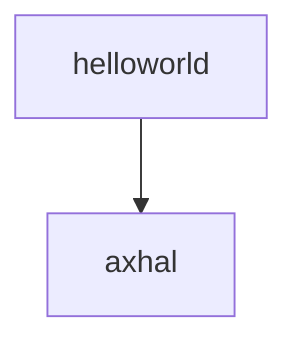

## helloworld 程序基于 axhal 组件实现输出

按照上一部分，既然 axhal 组件已经为我们准备好了 putchar 输出函数，其实我们已经可以编写 helloworld 程序进行输出了，如果关注了第三部分中 helloworld 运行的完整流程图就可以发现 helloworld 的运行还依赖于 libax，libax 就是提供一层类似于库函数的封装，它实现输出的本质还是用到我们提到的 axhal 中的输出，我们在此部分更多考虑地是 helloworld 与 axhal 组件进行搭配并且输出的过程，libax 可以看成是 helloworld 程序的一部分。

### 动手尝试




我们看到 boot.rs 的汇编代码最后有一段跳转到 entry 的代码， 目前来说，ArceOS 运行到这里之后，就会跳转到 rust_entry 函数（在axhal/src/platform/qemu_virt_riscv/mod.rs 文件中），这个函数会执行一些初始化流程，然后调用rust_main 函数（在 modules/axruntime/src/lib.rs 文件中）， rust_main 函数会根据选择的 feature 进行初始化的流程， 最后会调用应用程序的 main 函数。

为避免引入过多组件， 我们直接将 axhal/src/platform/qemu_virt_riscv/mod.rs 里面 rust_entry 中调用的 rust_main() 函数换成应用程序的 main 函数(记得要在上面 extern 引用 main 函数)， 并加上一行 self::misc::terminate()， 方便 arceos 运行完程序后终止，以防止ArceOS卡死不能正常退出（目前退出的功能依赖于下一部分提到的axruntime组件）。

axhal/src/platform/qemu_virt_riscv/mod.rs

```rust
extern "C" {
    fn trap_vector_base();
    fn rust_main(cpu_id: usize, dtb: usize);
    fn main();  // 从外部引入main函数
    #[cfg(feature = "smp")]
    fn rust_main_secondary(cpu_id: usize);
}

unsafe extern "C" fn rust_entry(cpu_id: usize, dtb: usize) {
    crate::mem::clear_bss();
    crate::cpu::init_primary(cpu_id);
    crate::arch::set_trap_vector_base(trap_vector_base as usize);
    // rust_main(cpu_id, dtb);
    main();  // 跳转到应用程序的main函数
    self::misc::terminate();  // 程序运行后终止
}
```

执行: 

```shell
make ARCH=riscv64 A=apps/helloworld run
```

 如无意外， helloworld成功输出！说明我们的思路是正确的，将要输出的内容通过 helloworld 传递给 axhal，这样只需要两个组件就能实现应用程序 helloworld 的运行和输出。


### 总结

其实 helloworld 程序本质还是调用 axhal 的 sbi 输出功能（具体步骤见第三部分流程图），我们把两个组件结合了起来！这也体现了 ArceOS 的思想，只需要把需要的部分组合起来就能实现我们想要的功能。

### 附录

[helloworld源代码](https://github.com/rcore-os/arceos/blob/main/apps/helloworld/src/main.rs) 

[helloworld文档](https://github.com/rcore-os/arceos/blob/main/doc/apps_helloworld.md) 
