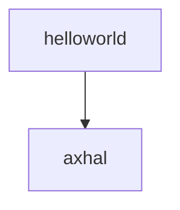
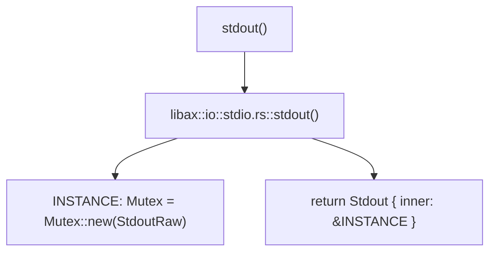
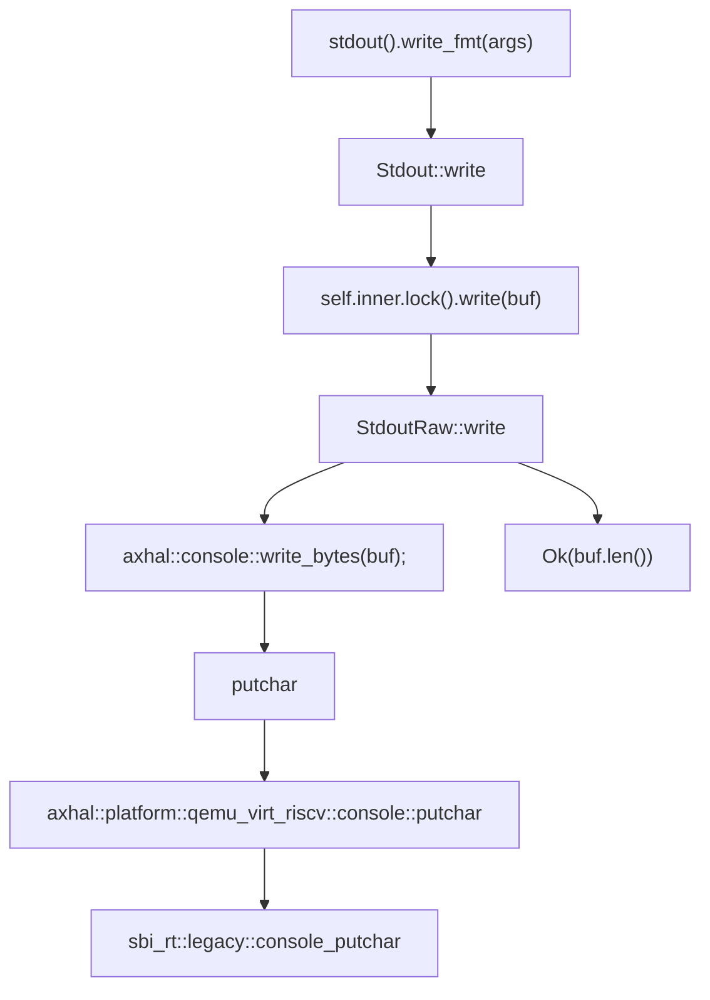

# 细胞的增殖与扩展

​	——两个组件，应⽤helloworld和axhal

按照上一部分，我们只需要使用axhal这个模块就能实现输出功能了，那么这个模块怎么和其他应用或者模块组合呢， 我们看到boot.rs的汇编代码最后有一段跳转到entry的代码， 目前来说，我们arceos运行到这里之后，就会跳转到rust_entry这个函数，(在axhal/src/platform/qemu_virt_riscv/mod.rs文件中)这个函数会执行一些初始化流程，然后调用rust_main函数(在modules/axruntime/src/lib.rs文件中)， rust_main函数会根据选择的feature进行初始化的流程， 最后会调用应用程序的main函数。 

// todo 感觉以后可以添加一些细节，  比如 函数接口通过extern暴露给其他文件访问 之类的知识点

既然我们都已经实现了基本的输出功能， 那我们直接依靠axhal输出helloworld不就可以了吗? 

try it。




我们在这里选择一种不太优雅的方案， 我们直接将axhal/src/platform/qemu_virt_riscv/mod.rs里面rust_entry中调用的rust_main()函数换成应用程序的main函数(记得要在上面extern 引用main函数)， 并加上一行self::misc::terminate()， 以方便arceos运行完程序后终止。

axhal/src/platform/qemu_virt_riscv/mod.rs

```rust
extern "C" {
    fn trap_vector_base();
    fn rust_main(cpu_id: usize, dtb: usize);
    fn main();  // 从外部引入main函数
    #[cfg(feature = "smp")]
    fn rust_main_secondary(cpu_id: usize);
}

unsafe extern "C" fn rust_entry(cpu_id: usize, dtb: usize) {
    crate::mem::clear_bss();
    crate::cpu::init_primary(cpu_id);
    crate::arch::set_trap_vector_base(trap_vector_base as usize);
    // rust_main(cpu_id, dtb);
    main();  // 跳转到应用程序的main函数
    self::misc::terminate();  // 程序运行后终止
}
```

我们确实成功运行并输出helloworld了，说明我们的思路是正确的，我们只需要两个组件就能实现我们应用程序helloworld的输出。


让我们看看我们实际上做了什么。

//  todo              流程图分析


```mermaid
graph TD;
    A[main] --> B["libax::println!(Hello, world!)"];
    B --> C[libax:io::__print_impl];
    C --> D[INLINE_LOCK=Mutex::new];
    C --> _guard=INLINE_LOCK.lock;
    C --> E["stdout().write_fmt(args)"];
```







从上面的流程图来看，helloworld程序本质还是调用axhal的sbi输出功能，我们把两个细胞结合了起来！这也体现了ArceOS的思想，我们只需要把我们需要的部分组合起来就能实现我们所需要的功能。之所以将helloworld的main函数和axhal组合起来就能实现输出功能，是因为helloworld应用程序所需要的feature几乎没有，只是用到了axhal的输出功能， 如果我们需要支持更复杂的应用， 那么我们就需要用到axruntime这个组件了。

扩展阅读: 

​	helloworld源代码: [www.github.com/rcore-os/arceos/helloworld/src/main.rs](www.github.com/rcore-os/arceos/helloworld/src/main.rs)

​	helloworld文档: [www.github.com/rcore-os/arceos/doc/app-helloworld.md](www.github.com/rcore-os/arceos/doc/app-helloworld.md)
