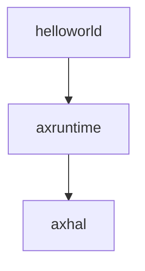

# 从细胞到生物

——三个组件，应⽤helloworld、引导组件axhal和运⾏时axruntime

axruntime组件说明: axruntime 的功能主要是在进入应用程序的main函数之前执行一些初始化操作， 根据所选择的不同feature执行相对应的初始化过程。 

在这一步我们直接使用ArceOS的源代码， 在axhal执行完后不是直接跳转的应用程序的main函数， 而是跳转到axruntime这个组件的rust_main()函数，再跳转到helloworld的main函数。

运行结果， 即跟初始输出一样(不修改arceos直接运行make ARCH= riscv64 A=apps/helloworld run LOG=debug)， 能输出helloworld和一些调试信息。

下面的调试输出信息可以为我们直观地展示axruntime做的一些初始化的工作

有了这三个组件，我们不仅能运行helloworld这样的"微生物"，还能运行各种各样的"生物"。

运行yield应用(FIFO scheduler): make A=apps/task/yield ARCH=riscv64 LOG=info NET=y SMP=1 run

到这里我们已经能够完整的去了解我们完整的ArceOS启动的第一步的步骤了:

// todo 流程图分析

```mermaid
graph TD;
    A[axhal::platform::qemu_virt_riscv::boot.rs::_boot] --> init_boot_page_table;
    A --> init_mmu;
    A --> P[platform_init];
    A --> B[axruntime::rust_main];
    P --> P1["axhal::mem::clear_bss()"];
    P --> P2["axhal::arch::riscv::set_trap_vector_base()"];
    P --> P3["axhal::cpu::init_percpu()"];
    P --> P4["axhal::platform::qemu_virt_riscv::irq.rs::init()"];
    P --> P5["axhal::platform::qemu_virt_riscv::time.rs::init()"];
    B --> axlog::init;
    B --> D[init_allocator];
    B --> remap_kernel_memory;
    B --> axtask::init_scheduler;
    B --> axdriver::init_drivers;
    B --> Q[axfs::init_filesystems];
    B --> axnet::init_network;
    B --> axdisplay::init_display;
    B --> init_interrupt;
    B --> mp::start_secondary_cpus;
    B --> C[main];
    Q --> Q1["disk=axfs::dev::Disk::new()"];
    Q --> Q2["axfs::root::init_rootfs(disk)"];
    Q2 --fatfs--> Q21["main_fs=axfs::fs::fatfs::FatFileSystem::new()"];
    Q2 --> Q22["MAIN_FS.init_by(main_fs); MAIN_FS.init()"];
    Q2 --> Q23["root_dir = RootDirectory::new(MAIN_FS)"];
    Q2 --devfs--> Q24["axfs_devfs::DeviceFileSystem::new()"];
    Q2 --devfs--> Q25["devfs.add(null, zero, bar)"];
    Q2 -->Q26["root_dir.mount(devfs)"];
    Q2 -->Q27["init ROOT_DIR, CURRENT_DIR"];
    D --> E["In free memory_regions: axalloc::global_init"];
    D --> F["In free memory_regions:  axalloc::global_add_memory"];
    E --> G[axalloc::GLOBAL_ALLOCATOR.init];
    F --> H[axalloc::GLOBAL_ALLOCATOR.add_memory];
    G --> I["PAGE: self.palloc.lock().init"];
    G --> J["BYTE: self.balloc.lock().init"];
    H --> K["BYTE: self.balloc.lock().add_memory"];
    I --> M["allocator::bitmap::BitmapPageAllocator::init()"];
    J -->L["allocator::slab::SlabByteAllocator::init() self.inner = unsafe { Some(Heap::new(start, size))"];
    K --> N["allocator::slab::SlabByteAllocator::add_memory:  self.inner_mut().add_memory(start, size);"];


```

链接: [https://github.com/rcore-os/arceos/blob/main/doc/init.md](https://github.com/rcore-os/arceos/blob/main/doc/init.md)

初始化完成后，我们再根据上一部分helloworld输出的流程图，就可以完整的了解helloworld的运行背后发生了什么了。

扩展阅读: 

​		axruntime源代码: [www.github.com/rcore-os/arceos/modules/axruntime/](www.github.com/rcore-os/arceos/modules/axruntime/)

下面是内部交流部分

------------------------------------------------------------------------

 下面是一些思路及问题总结， 

还存在的问题和能改进的地方:

​		首先是第一部分， sbi的输出其实可以复用arceos其中的putchar函数，更优雅地展示sbi输出.  arceos自己的putchar肯定是可以用,只是我不知道这个需要的参数怎么传进去。  其次还有一些流程图还没有具体地展开解释。

​		然后是思路方面， 我没有过多地关注crate和moudle层, 更多地是在代码层面进行一些增加或者改动， 去体现开机引导到helloworld运行的过程， 更好的解决方案是兼顾开机引导的部分和crate组合的部分，但是时间和能力有限 ， 还没来得及做crate结合的部分, 更多侧重于axhal和axruntime和helloworld三者之间的联系.  
