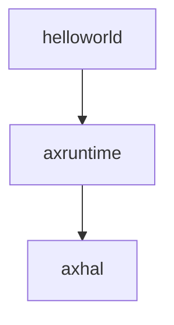
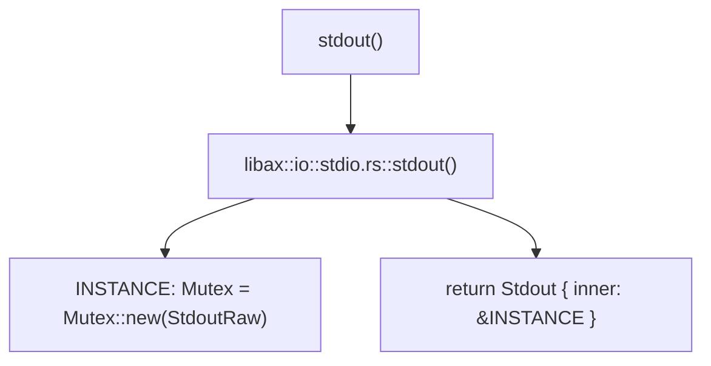
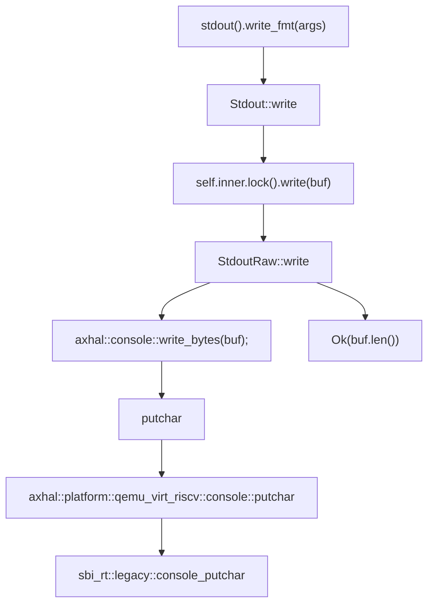

## 添加 axruntime 组件提供更完整的运行环境

之所以将 helloworld 的 main 函数和 axhal 组合起来就能实现输出功能，是因为 helloworld 应用程序只用到了 axhal 提供的裸机输出功能， 如果我们需要支持更复杂的应用，axhal 提供的低级的裸机环境肯定不能满足我们的需求， 那么就需要用到 axruntime 这个更强大的组件了。

axruntime 的主要功能是在进入应用程序的 main 函数之前执行一些初始化操作， 根据所选择的不同 feature 执行相对应的初始化过程。 



在这一节中我们直接使用 ArceOS 的源代码，将之前修改的代码还原，在 axhal 执行完后不是直接跳转到应用程序的 main 函数， 而是跳转到 axruntime 这个组件的 rust_main 函数，再跳转到 helloworld 的 main 函数。

### 动手尝试

运行命令：

```shell
make PLATFORM=riscv64-qemu-virt A=apps/helloworld run LOG=debug
```

运行结果如下图，下面的调试输出信息绿色字体部分可以为我们直观地展示 axruntime 做的一些初始化的工作。


有了这三个组件，我们不仅能运行 helloworld 这样的简单程序，还能运行稍微复杂一些的程序。

例如，运行 yield 应用程序 (FIFO scheduler): 

```shell
make A=apps/task/yield PLATFORM=riscv64-qemu-virt LOG=info NET=y SMP=1 run
```

运行结果: 


### 运行过程分析

让我们通过流程图看看 ArceOS 的运行背后到底发生了什么。

第一步是一些初始化函数的调用过程。

#### Step 1

[comment]: <> (下表太大，在浏览器中无法正常显示)


下面是 helloworld 程序的运行流程，实际上 helloworld 程序最后调用的是 axhal 封装好的输出功能，本质还是依靠 sbi 进行输出。

#### Step 2

```mermaid
graph TD;
    A[main] --> B["libax::println!(Hello, world!)"];
    B --> C[libax:io::__print_impl];
    C --> D[INLINE_LOCK=Mutex::new];
    C --> _guard=INLINE_LOCK.lock;
    C --> E["stdout().write_fmt(args)"];
```


##### step 2.1




##### step 2.2




### 总结

至此，我们已经完成了从 axhal 到 axruntime 到 helloworld 的组合了，并且将 helloworld unikernel 运行了起来。

### 附录

- ```axruntime``` 模块简介：
- 模块源码位置：[modules/axruntime]((https://github.com/rcore-os/arceos/tree/main/modules/axruntime) )


  - 功能描述：在进入应用程序的 main 函数之前执行一些初始化操作， 根据所选择的 feature 执行相对应的初始化过程。

- 流程图来源：

    - step 1 [init](https://github.com/rcore-os/arceos/blob/main/doc/init.md)
  
  
    - step 2 [helloworld](https://github.com/rcore-os/arceos/blob/main/doc/apps_helloworld.md)
