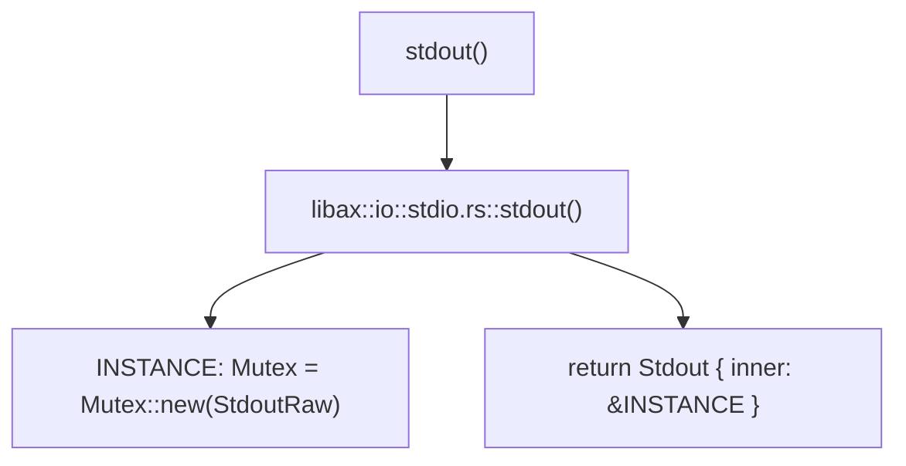
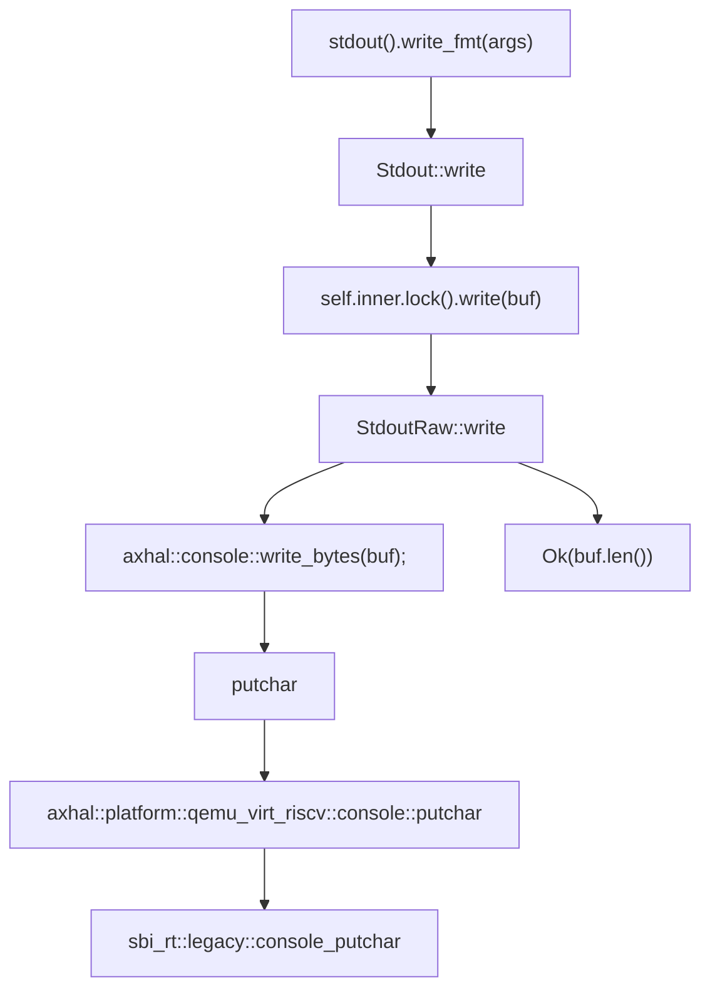
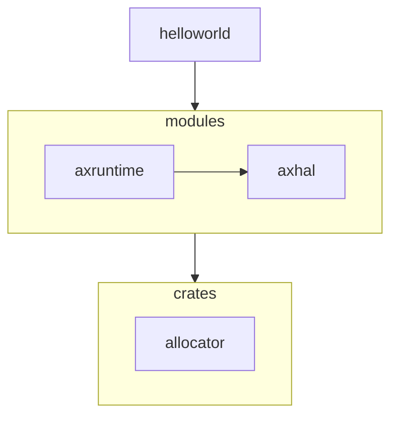
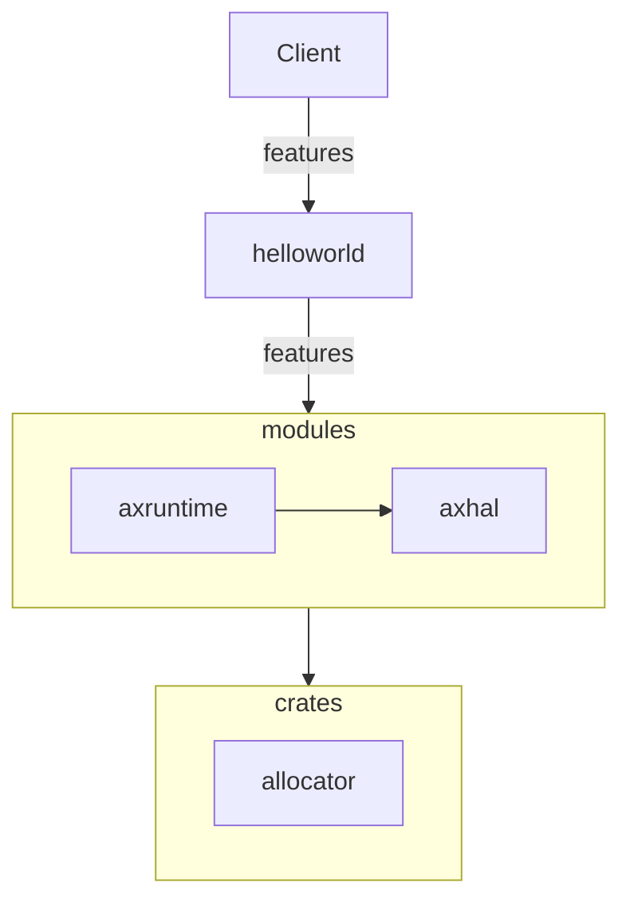

```mermaid
graph TD;
    A[axhal::platform::qemu_virt_riscv::boot.rs::_boot] --> init_boot_page_table;
    A --> init_mmu;
    A --> P[platform_init];
    A --> B[axruntime::rust_main];
    P --> P1["axhal::mem::clear_bss()"];
    P --> P2["axhal::arch::riscv::set_trap_vector_base()"];
    P --> P3["axhal::cpu::init_percpu()"];
    P --> P4["axhal::platform::qemu_virt_riscv::irq.rs::init()"];
    P --> P5["axhal::platform::qemu_virt_riscv::time.rs::init()"];
    B --> axlog::init;
    B --> D[init_allocator];
    B --> remap_kernel_memory;
    B --> axtask::init_scheduler;
    B --> axdriver::init_drivers;
    B --> Q[axfs::init_filesystems];
    B --> axnet::init_network;
    B --> axdisplay::init_display;
    B --> init_interrupt;
    B --> mp::start_secondary_cpus;
    B --> C[main];
    Q --> Q1["disk=axfs::dev::Disk::new()"];
    Q --> Q2["axfs::root::init_rootfs(disk)"];
    Q2 --fatfs--> Q21["main_fs=axfs::fs::fatfs::FatFileSystem::new()"];
    Q2 --> Q22["MAIN_FS.init_by(main_fs); MAIN_FS.init()"];
    Q2 --> Q23["root_dir = RootDirectory::new(MAIN_FS)"];
    Q2 --devfs--> Q24["axfs_devfs::DeviceFileSystem::new()"];
    Q2 --devfs--> Q25["devfs.add(null, zero, bar)"];
    Q2 -->Q26["root_dir.mount(devfs)"];
    Q2 -->Q27["init ROOT_DIR, CURRENT_DIR"];
    D --> E["In free memory_regions: axalloc::global_init"];
    D --> F["In free memory_regions:  axalloc::global_add_memory"];
    E --> G[axalloc::GLOBAL_ALLOCATOR.init];
    F --> H[axalloc::GLOBAL_ALLOCATOR.add_memory];
    G --> I["PAGE: self.palloc.lock().init"];
    G --> J["BYTE: self.balloc.lock().init"];
    H --> K["BYTE: self.balloc.lock().add_memory"];
    I --> M["allocator::bitmap::BitmapPageAllocator::init()"];
    J -->L["allocator::slab::SlabByteAllocator::init() self.inner = unsafe { Some(Heap::new(start, size))"];
    K --> N["allocator::slab::SlabByteAllocator::add_memory:  self.inner_mut().add_memory(start, size);"];


```

# 组装helloworld
## 1.从单细胞开始  

​		—— ⼀个组件axhal，从系统引导到输出

ArceOS是一个组件化的系统 ，接下来三部分，我们将会对ArceOS的代码进行一点点修改，以体现组件间的密切联系和ArceOS启动的流程。

为了输出helloworld, 我们首先要做的是根据axhal构建出一个最简单的输出环境,，以qemu_virt_riscv平台为例， 我们首先关注

``` shell
modules/axhal/src/platform/qemu_virt_riscv/boot.rs 
```

这个文件， 其中的_start()函数被链接到".text.boot"段， 作为ArceOS运行的第一段代码。  具体的内存分配可以查看modules/axhal/linker.lds.S文件。

接下来我们尝试在里面调用sbi输出。

添加sbi_call函数:

```rust
fn sbi_call(which: usize， arg0: usize， arg1: usize， arg2: usize) -> isize{
    let ret: isize;
    unsafe{
        core::arch::asm!("ecall",
             lateout("x10") ret,
             in("x10") arg0, in("x11") arg1, in("x12") arg2, in("x17") which
            );
    }
    ret
}
```

添加console_putchar函数方便输出我们想要输出的结果

```rust
const SBI_CONSOLE_PUTCHAR: usize = 1;

unsafe fn console_putchar() {
  sbi_call(SBI_CONSOLE_PUTCHAR, 12, 0, 0);
  // 下面可以输出任何想要的内容， 只需更改第二个参数即可
}
```

然后我们需要在汇编代码中加入对console_putchar函数的调用， 我们需要在初始化页表之后， 初始化mmu之前执行console_putchar函数。 并且添加

```rust
console_putchar = sym console_putchar,
```

这一行， 以便汇编代码调用我们写的console_putchar函数

完整的代码 (boot.rs) :

```rust
const SBI_CONSOLE_PUTCHAR: usize = 1;

unsafe fn console_putchar(){
    sbi_call(SBI_CONSOLE_PUTCHAR, 10, 0, 0); 
    sbi_call(SBI_CONSOLE_PUTCHAR, 72, 0, 0);
    sbi_call(SBI_CONSOLE_PUTCHAR, 69, 0, 0);
    // 下面自行添加需要的输出字符即可
}

fn sbi_call(which: usize, arg0: usize, arg1: usize, arg2: usize) -> isize{
    let ret: isize;
    unsafe{
        core::arch::asm!("ecall",
             lateout("x10") ret,
             in("x10") arg0, in("x11") arg1, in("x12") arg2, in("x17") which
            );
    }
    ret
}


#[link_section = ".bss.stack"]
static mut BOOT_STACK: [u8; TASK_STACK_SIZE] = [0; TASK_STACK_SIZE];

#[link_section = ".data.boot_page_table"]
static mut BOOT_PT_SV39: [u64; 512] = [0; 512];

unsafe fn init_boot_page_table() {
    ...
}

unsafe fn init_mmu() {
    ...
}

/// The earliest entry point for the primary CPU.
#[naked]
#[no_mangle]
#[link_section = ".text.boot"]
unsafe extern "C" fn _start() -> ! {
    // PC = 0x8020_0000
    // a0 = hartid
    // a1 = dtb
    core::arch::asm!("

        mv      s0, a0                  // save hartid
        mv      s1, a1                  // save DTB pointer
        la      sp, {boot_stack}
        li      t0, {boot_stack_size}
        add     sp, sp, t0              // setup boot stack

        call    {init_boot_page_table}
        call    {console_putchar}       // 执行console_putchar函数
        call    {init_mmu}              // setup boot page table and enabel MMU

        li      s2, {phys_virt_offset}  // fix up virtual high address
        add     sp, sp, s2

        mv      a0, s0
        mv      a1, s1
        la      a2, {entry}
        add     a2, a2, s2
        jalr    a2                      // call rust_entry(hartid, dtb)
        j       .",
        phys_virt_offset = const PHYS_VIRT_OFFSET,
        boot_stack_size = const TASK_STACK_SIZE,
        boot_stack = sym BOOT_STACK,
        init_boot_page_table = sym init_boot_page_table,
        init_mmu = sym init_mmu,
        entry = sym super::rust_entry,
        console_putchar = sym console_putchar,  // 以便汇编代码调用
        options(noreturn),
    )
}
```

此时我们只需执行

```shell
make ARCH=riscv64 A=apps/helloworld run
```

 如无意外， 我们在打印ArceOS的LOGO之前看到了我们之前调用sbi_call进行的输出"HELLO FROM SBI"， 当然，每个字符的输出只需要在console_putchar中自行添加即可。 


至此，我们已经完成了从系统引导到输出的最小流程， 而且从代码来看，从开机到输出这个过程不依赖于任一组件，并且是能在真实的硬件环境中(例如CV1811H开发板)进行输出， 这也体现了aeceos的设计思路， 我们只需要复用这一个模块，我们就能很方便地对硬件进行操作了。 当然，arceos中有更完整的封装好的console输出流程，上面只是一些直观简单的输出尝试，不过这一点简单的尝试已经可以体现出我们单细胞强大的生命力了。

## 2.细胞的增殖与扩展  

​	——两个组件，应⽤helloworld和axhal

按照上一部分，我们只需要使用axhal这个模块就能实现输出功能了，那么这个模块怎么和其他应用或者模块组合呢， 我们看到boot.rs的汇编代码最后有一段跳转到entry的代码， 目前来说，我们arceos运行到这里之后，就会跳转到rust_entry这个函数，(在axhal/src/platform/qemu_virt_riscv/mod.rs文件中)这个函数会执行一些初始化流程，然后调用rust_main函数(在modules/axruntime/src/lib.rs文件中)， rust_main函数会根据选择的feature进行初始化的流程， 最后会调用应用程序的main函数。 

// todo 感觉以后可以添加一些细节，  比如 函数接口通过extern暴露给其他文件访问 之类的知识点

既然我们都已经实现了基本的输出功能， 那我们直接输出helloworld不就可以了吗? 

try it。

我们在这里选择一种不太优雅的方案， 我们直接将axhal/src/platform/qemu_virt_riscv/mod.rs里面rust_entry中调用的rust_main()函数换成应用程序的main函数(记得要在上面extern 引用main函数)， 并加上一行self::misc::terminate()， 以方便arceos运行完程序后终止。

axhal/src/platform/qemu_virt_riscv/mod.rs

```rust
extern "C" {
    fn trap_vector_base();
    fn rust_main(cpu_id: usize, dtb: usize);
    fn main();  // 从外部引入main函数
    #[cfg(feature = "smp")]
    fn rust_main_secondary(cpu_id: usize);
}

unsafe extern "C" fn rust_entry(cpu_id: usize, dtb: usize) {
    crate::mem::clear_bss();
    crate::cpu::init_primary(cpu_id);
    crate::arch::set_trap_vector_base(trap_vector_base as usize);
    // rust_main(cpu_id, dtb);
    main();  // 跳转到应用程序的main函数
    self::misc::terminate();  // 程序运行后终止
}
```

我们确实成功运行并输出helloworld了，说明我们的思路是正确的，我们只需要两个组件就能实现我们应用程序helloworld的输出。


让我们看看我们实际上做了什么。

//  todo              流程图分析


```mermaid
graph TD;
    A[main] --> B["libax::println!(Hello, world!)"];
    B --> C[libax:io::__print_impl];
    C --> D[INLINE_LOCK=Mutex::new];
    C --> _guard=INLINE_LOCK.lock;
    C --> E["stdout().write_fmt(args)"];
```







从上面的流程图来看，helloworld程序本质还是调用axhal的sbi输出功能，我们把两个细胞结合了起来！这也体现了ArceOS的思想，我们只需要把我们需要的部分组合起来就能实现我们所需要的功能。之所以将helloworld的main函数和axhal组合起来就能实现输出功能，是因为helloworld应用程序所需要的feature几乎没有，只是用到了axhal的输出功能， 如果我们需要支持更复杂的应用， 那么我们就需要用到axruntime这个组件了。

## 3.从细胞到生物  

​	 ——三个组件，应⽤helloworld、引导组件axhal和运⾏时axruntime


在这一步我们直接使用ArceOS的源代码， 在axhal执行完后不是直接跳转的应用程序的main函数， 而是跳转到axruntime这个组件的rust_main()函数，再跳转到helloworld的main函数。

axruntime 的功能主要是在进入应用程序的main函数之前执行一些初始化操作， 根据所选择的不同feature执行相对应的初始化过程。 

运行结果， 即跟初始输出一样(不修改arceos直接运行make ARCH= riscv64 A=apps/helloworld run LOG=debug)， 能输出helloworld和一些调试信息。

下面的调试输出信息可以为我们直观地展示axruntime做的一些初始化的工作


有了这三个组件，我们不仅能运行helloworld这样的"微生物"，还能运行各种各样的"生物"。

运行yield应用(FIFO scheduler): make A=apps/task/yield ARCH=riscv64 LOG=info NET=y SMP=1 run


到这里我们已经能够完整的去了解我们完整的ArceOS启动的第一步的步骤了:

// todo 流程图分析



链接: https://github.com/rcore-os/arceos/blob/main/doc/init.md

初始化完成后，我们再根据上一部分helloworld输出的流程图，就可以完整的了解helloworld的运行背后发送了什么了。


下面是内部交流部分

------------------------------------------------------------------------

 下面是一些思路及问题总结， 

还存在的问题和能改进的地方:

​		首先是第一部分， sbi的输出其实可以复用arceos其中的putchar函数，更优雅地展示sbi输出.  arceos自己的putchar肯定是可以用,只是我不知道这个需要的参数怎么传进去。  其次还有一些流程图还没有具体地展开解释。

​		然后是思路方面， 我没有过多地关注crate和moudle层, 更多地是在代码层面进行一些增加或者改动， 去体现开机引导到helloworld运行的过程， 更好的解决方案是兼顾开机引导的部分和crate组合的部分，但是时间和能力有限 ， 还没来得及做crate结合的部分, 更多侧重于axhal和axruntime和helloworld三者之间的联系.  

## 4. 系统分层：操作系统相关和无关组件

在之前的部分中，我们从实际需求出发，从仅仅想着实现打印helloworld功能开始，

核心概念：分裂和扩展

第一阶段：“未有天地之时，混沌状如鸡子”：构建一个可以与硬件交互的最小运行环境axhal，也可以理解为，我们可以在完成引导和必要功能初始化之后就可以直接调用对应平台的汇编指令来实现打印helloworld的功能，此时用户功能（向屏幕打印hello world）和运行时环境是混合在一起的。

第二阶段：“清轻者上升为天，重浊者下降为地”：axhal+helloworld， 尝试将打印helloworld功能进行分离并扩展，令helloworld变成一个独立的app。该阶段需要定义程序入口，我们尝试在axhal中设置程序入口点，可以令程序经过引导之后直接跳转到app的地址执行功能。

第三阶段：进一步演化，axhal+axruntime+helloworld：我们不满足于用户直接基于axhal提供的低级的裸环境的服务来进行开发，所以将axhal包装并扩展成axruntime来提供各种运行时的环境准备，和axhal相比，axruntime进一步掩盖掉于底层交互的复杂原理，此时helloworld的运行环境由直接依赖于axhal变成了更为人性化的axruntime。

在之前的部分中，println所打印的都是静态字符串存储在内存中的代码段中，不涉及到动态分配内存。如果我们想尝试使用动态分配的类型怎么办？例如我们想创建一个String类型的字符串，然后通过println的format机制将组合成出来的字符串打印出来。

进一步分析我们目前的需求，发现我们的目的变成了我们的操作系统ArceOS为用户的应用程序helloworld提供内存分配支持，基于ArceOS的组件化的设计思想，暴露给用户所需要的改动就是：“我想为支持我应用的环境开启动态内存分配的特性，以便我来进行使用”

我们回想一下对Unikernel这个概念的讲解，操作系统千千万万，但是通过将各个功能进行拆分和罗列，发现支撑操作系统的功能单元其实有共性可言，比如果一个操作系统想要实现多个任务切换，那这个操作系统一定要涉及到任务（进程）的调度算法，而这种可以分离成单独的模块甚至可以被其他操作系统所复用的特点，在ArceOS的设计体系中我们称之为系统无关，而相反，之前部分涉及到的axhal和axruntime这种，是ArceOS本身利用硬件资源和为用户程序打造运行时环境的独一无二的方式，并且这种组合扩展方式是不同于其他操作系统的，所以这些模块我们称其为系统相关，代表了特定类型的操作系统来运用系统无关组件来打造运行时环境的独特方式，与其他系统的设计方式是强冲突的，无法被其他系统所复用。

具体到ArceOS的源代码组成部分来区分系统无关和系统相关来看，目前属于crates文件夹下属于是系统无关的库，这些库可以理解为构建一个操作系统所需要的底层共性，我们以松耦合，高可用的方式开发这些库，目的是后续可能使别的系统进行调用。而modules下就是我们ArceOS为了想要实现操作系统的必要功能而对crates的各种库添加和组合的更加靠近用户应用的抽象层。这些库是ArceOS为了满足自身的需要而开发的，属于是ArceOS独有的实现内容，具有强烈的专属性。~~而ulib层是将modules层的所有功能进行统一起来为用户提供统一的操作接口的，是用户层之下的最顶的一个层。~~

那么回到这个动态分配这个主题中，我们根据之前分类的标准，很容易发现动态分配特性是属于系统无关的，结合之前调用依赖图，我们将其更新为下图所示：



这里我们简化了展示，删除了额外辅助类的模块的添加，只展示了必要的功能依赖链。

具体体现在代码实际操作中，我们修改apps/helloworld/Cargo.toml，添加开启动态内存分配的feature

```toml
[package]
name = "arceos-helloworld"
version = "0.1.0"
edition = "2021"
authors = ["Yuekai Jia <equation618@gmail.com>"]

# See more keys and their definitions at https://doc.rust-lang.org/cargo/reference/manifest.html

[dependencies]
libax = { path = "../../ulib/libax", features=["alloc"]}
```

之后，我们修改apps/helloworld/src/main.rs，尝试使用alloc特性提供的动态分配内存功能：

```rust
#![no_std]
#![no_main]

use libax::println;
#为helloworld提供可以动态内存分配的字符串类型
use libax::string::String;

#[no_mangle]
fn main() {
	# 声明并赋值一个String字符串
    let s = String::from("I am ArceOS!");
    println!("Hello, world! {}", s);
}
```

我们尝试运行
```make A=apps/helloworld ARCH=riscv64 LOG=info run```，此时运行结果如下图所示：


打印出”Hello world! I am ArceOS"，说明我们成功为helloworld提供动态内存分配功能。

其实像这种ArceOS在用户看不见的地方根据用户选择的特性需求，组装并扩展各种模块提供用户定制的运行环境以达到目的，其实就是ArceOS的组件化的运作方式的核心机制。我们从最简单的helloworld使用alloc feature，“窥一斑而知全豹”，来初步触及ArceOS的核心运作机制。在后续的章节我们会为读者展示ArceOS更为强大的功能特性，虽然和helloworld相比换变得很复杂，但是其功能运作的基本原理和helloworld大体相似，相信读者理解了这部分的内容，后续的章节理解起来会更为顺畅一些。

~~crate allocator ：~~

~~功能描述：提供多种内存分配器，提供统一接口用于其他库调用。~~

~~按照分配颗粒度功能来区分为byte allocator、page allocator和id allocator~~

## 5. features控制特性


这部分讲的是用户可以通过修改运行命令的内容，来进一步细粒度的控制feature特性，

以log为例，我们想要修改日志的展示等级，例如，最低展示出info级的日志就可以，所以我们可以修改原来的运行命令，这里还是以qemu risv64平台为例，原始命令为：

```bash
make A=apps/helloworld ARCH=riscv64 LOG=info run
```

我们试一下运行结果：发现，info以上级别的日志会被打印出来（提示：绿色字体所在行为info级别的日志打印）


如果我们修改log日志等级：

```bash
make A=apps/helloworld ARCH=riscv64 LOG=warn run
```

此时能够展示日志的最低级别提高到warn，之前info级别的日志不会被打印到屏幕中，我们尝试运行一下上述命令，运行结果如下：


我们可以看到之前展示出来绿色字体的info日志行都消失了。

分析：feature的参数控制也是ArceOS强大的功能之一，和之前的功能不同，用户从开启或关闭feature变成了具体操作feature特性的参数，以便调整到自己所需要的最佳运行效果。用户通过运行命令来调整feature的传递流程可以用下图来表示：





结合图中展示和具体实现部分，用户(Client)通过命令传递给想要控制的参数，依次往下传递给helloworld到modules，最终在具体代码：modules/axruntime/src/lib.rs line 123:

```rust
 axlog::set_max_level(option_env!("LOG").unwrap_or(""));
```

接收用户在命令上设置的```LOG=[error/warn/info/debuf/trace]```来实现对log feature的控制。

用户在命令上尝试进行其他参数控制的时候也就经历类似于LOG的feature传递，达到真正的代码实现位置将用户设置更新到系统上。可能自顶向下的寻找路线不同（需要达到feature对应的功能模块），所需要的路径长短不同（所需要控制的feature可能需要和硬件驱驱动进行交互）。但是核心思路基本一致。

至此，我们以及通过这部分的介绍体现出来ArceOS强大的组件化，feature控制的能力。

