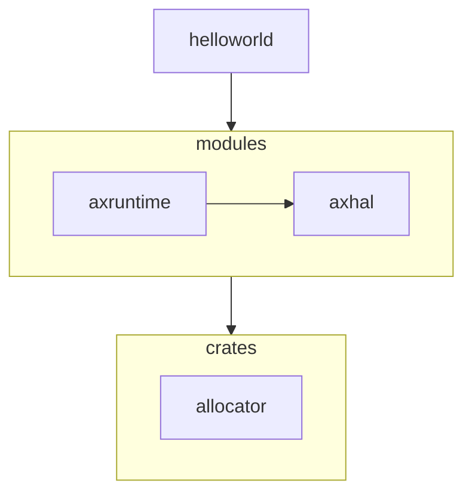

## 由开启动态内存分配特性来初识系统相关和无关

### 前三个阶段总结

在之前的部分中，我们以向屏幕打印“hello world”为目标，由简入繁，共经历了三个阶段，让我们做一个简单的总结：

第一阶段，“未有天地之时，混沌状如鸡子”，构建一个可以与硬件交互的最小运行环境 axhal，也可以理解为，我们可以在完成引导和必要功能初始化之后就可以直接调用对应平台的汇编指令来实现打印 helloworld 的功能，此时用户所需功能（向屏幕打印“hello world”）和运行时环境是混合在一起的。

第二阶段，“清轻者上升为天，重浊者下降为地”，上一阶段的程序分裂成 axhal+helloworld， 尝试将打印 helloworld 功能进行分离并扩展，令 helloworld 扩展成一个独立的 app。该阶段需要定义程序入口，我们尝试在 axhal 中设置入口点，令 axhal 经过引导之后直接跳转到 helloworld 中执行相应功能。

第三阶段，“天生日月星辰，地生山川草木”，第二阶段的两个模块进一步分裂并扩展为 axhal+axruntime+helloworld，我们不满足于用户直接基于 axhal 提供的低级的裸环境来进行开发，所以将 axhal 包装并扩展成 axruntime 来提供各种运行时必要组件，和 axhal 相比，axruntime 掩盖了与底层硬件交互的复杂原理，此时 helloworld 的运行环境由直接依赖于 axhal 变成了更为高级更为强大的 axruntime。

### 系统无关和系统相关

可以说在之前的部分中，就已经很好的体现出 ArceOS 形如细胞一样的强大分裂和扩展的功能。前三个阶段打印到屏幕的文字的实际存储位置位于 .text 段，由底层运行环境进行静态分配并管理的，这种管理方式的优势是开销小，性能高，缺点是灵活性不足。

如果我们想尝试使用动态分配的类型怎么办？具体来说，我们想创建一个 String 类型的字符串，然后通过 println 的格式化功能将组装后的字符串打印到屏幕。这个功能应该如何实现呢？

进一步分析上述的需求，发现我们的目的其实是操作系统 ArceOS 为用户的应用程序 helloworld 提供内存分配支持，那么如何优雅地为用户提供这种支持成了我们目前首要的目标。

回想一下上一个章对 Unikernel 这个概念的讲解，操作系统种类繁多，但是通过将各个功能进行深入拆分和罗列，发现支撑操作系统的功能模块其实有共性可言，比如一个操作系统想要实现多个任务切换，那这个操作系统一定要涉及到任务（进程）的调度算法，而这种可以分离成单独的模块甚至可以被其他操作系统所复用的特点，在 ArceOS 的设计体系中我们称之为系统无关；而相反，前面涉及到的 axhal 和 axruntime，是 ArceOS 本身利用系统无关的组件为用户程序打造运行时环境的特定实现方式，这种组合扩展方式是不同于其他操作系统的。所以这类模块我们称其为系统相关，代表了操作系统通过系统无关组件来打造用户程序运行环境的独特方式，无法被其他系统所复用。

具体到 ArceOS 的源码组成部分来看，目前 crates 文件夹下的模块属于是系统无关的模块，这些库可以理解为构建一个操作系统所需要的底层共性，我们以松耦合，高抽象的方式开发这些库，目的是后续可以为别的系统复用。modules 下的模块是 ArceOS 为了想要实现操作系统的必要功能而对 crates 的各种库组合和扩展后，更加接近用户应用层的抽象模块。

### 动手尝试

​		讲解完这两个基本概念，回到动态分配内存这个主题上，根据之前分类的标准，很容易发现动态分配特性是属于系统无关的，基于之前的调用依赖图，我们可以将其更新为如下图所示：



这里我们简化了一下，没有涉及到其他辅助类的模块的展示，只展示了必要的功能依赖链。

具体体现在代码中，首先，我们修改 apps/helloworld/Cargo.toml，添加开启动态内存分配的特性：

```toml
[dependencies]
libax = { path = "../../ulib/libax", features=["alloc"]} #尝试添加动态分配内存的feature
```

之后，我们修改 apps/helloworld/src/main.rs，尝试使用 alloc 特性提供的动态分配内存功能：

```rust
#![no_std]
#![no_main]

use libax::println;
#为 helloworld 提供可以动态内存分配的字符串类型
use libax::string::String;

#[no_mangle]
fn main() {
	# 声明并初始化一个 String 字符串
    let s = String::from("I am ArceOS!");
    println!("Hello, world! {}", s);
}
```

运行```make A=apps/helloworld ARCH=riscv64 LOG=info run```，此时运行结果如下图所示：


打印出”Hello world! I am ArceOS"，说明我们成功为 helloworld 提供了动态内存分配功能。

### 总结

其实像这种 ArceOS 在用户看不见的地方根据用户选择的特性需求，组装并扩展各种模块提供定制的运行环境，其实就是 ArceOS 的组件化运作的核心机制。我们从最简单的 helloworld 使用动态内存分配特性出发，“窥一斑而知全豹”，来触及 ArceOS 的核心运作机制。在后续的章节中我们会为读者展示 ArceOS 更为强大的功能特性，其功能运作的基本原理和 helloworld 是大体相似的，相信读者理解了这部分的内容，后续章节理解起来会更为顺畅一些。

### 附录

```allocator``` 模块简介：

模块源码位置：[crates/allocator](https://github.com/rcore-os/arceos/tree/main/crates/allocator)

功能描述： `allocator` 模块提供了一个统一的接口，用于实现不同类型的内存分配器算法。该模块共包括三种不同类型的分配器：字节粒度内存分配器 (`ByteAllocator`)、页粒度内存分配器 (`PageAllocator`) 和唯一 ID 分配器 (`IdAllocator`)。每种分配器都有其特定的实现方式，例如 `BuddyByteAllocator` 和 `SlabByteAllocator` 对应的是字节粒度内存分配器，而 `BitmapPageAllocator` 对应的是页粒度内存分配器。这个模块使得不同的内存分配器可以更加灵活地组合和替换，实现更加高效和可靠的内存管理功能。

ArceOS 设计思想推荐阅读：[像开发应用一样开发操作系统](https://github.com/chyyuu/thoughts/blob/main/tangram-oskits.md)
