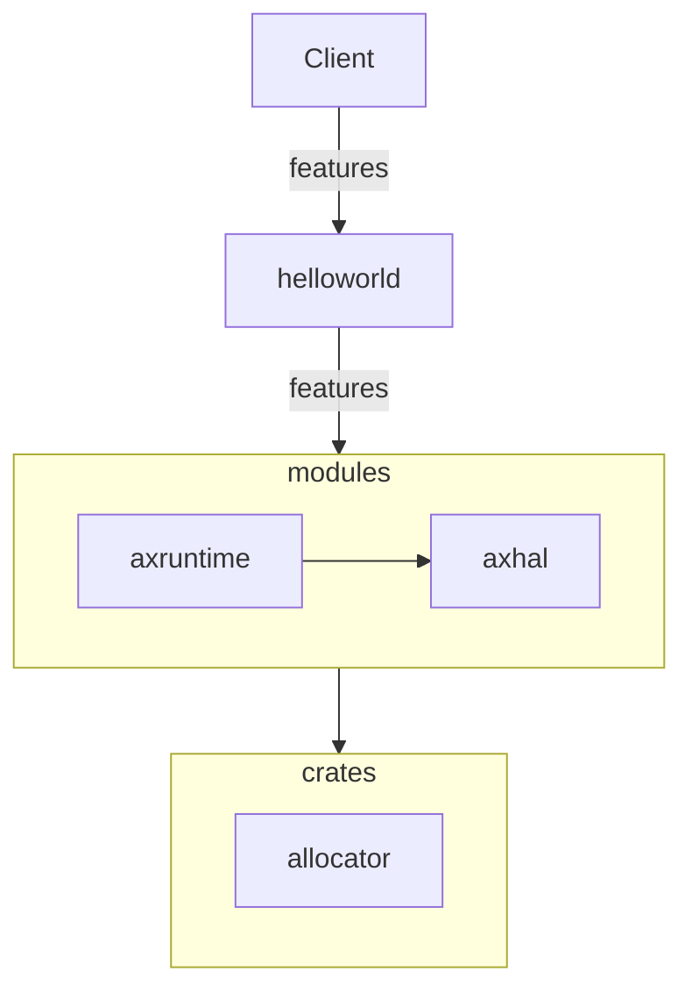

## 修改命令实现对features的细粒度控制

### 动手尝试

这部分讲的是用户可以通过修改运行命令的内容，来进一步细粒度的控制特性，这个部分比较简单，读者可以很轻松地完成。

以向屏幕打印日志信息为例，如果想要修改日志的过滤等级，例如，展示出 warn 级以上的日志（info 日志不会打印到屏幕上），可以修改原来的运行命令，这里还是以 qemu risv64 平台为例，原始命令为：

```bash
make A=apps/helloworld PLATFORM=riscv64-qemu-virt LOG=info run
```

尝试运行一下，发现 info 以上级别的日志会被打印出来（提示：绿色字体所在行为 info 级别的日志信息）：


如果修改 log 日志等级：

```bash
make A=apps/helloworld PLATFORM=riscv64-qemu-virt LOG=warn run
```

此时能够展示日志的最低级别提高到 warn，之前 info 级别的日志不会被打印到屏幕中，尝试运行上述命令，运行结果如下：


我们可以看到之前展示出来绿色字体的 info 日志行都消失了。

### 实现原理

feature 的参数控制也是 ArceOS 的强大功能之一，和之前的部分不同，用户从开启或关闭 feature 变成了具体调整 feature 特性的参数，以达到自己所需要的最佳环境支持。用户通过运行命令来调整 feature 的流程可以用下图来表示：



结合图中展示和具体实现部分，用户 (Client) 通过命令传递想要控制的参数，自顶往下由 helloworld 传递到 modules，最终抵达 modules/axruntime/src/lib.rs(123 行)```axlog::set_max_level(option_env!("LOG").unwrap_or(""));```这行代码, 接收用户在命令上设置的```LOG```控制参数来实现对日志过滤等级的控制。

### 总结

用户通过命令进行其他参数控制也经历类似于 LOG 的 feature 传递，然后抵达真正的实现位置，将用户设置应用到系统上。虽然可能自顶向下的寻找路线不同（需要达到 不同 feature 对应的功能模块），所需要的路径长短不同（要控制的 feature 可能需要和硬件驱动进行交互），但是核心思想都是一致的。可以类比为用户是一个操控者，通过手中的线（feature 命令参数）来控制木偶（ArceOS）来达到他想要的展示动作（运行环境）。


