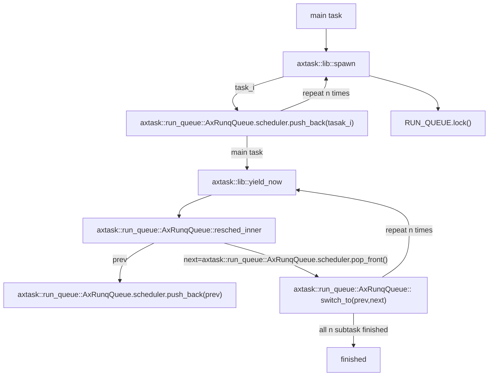

## 协作式多任务相关的crates/modules组成
### 什么是Crates和Modules
对于初学Rust的读者来说，在继续探索协作式多任务的具体实现前，最好先理解在Rust模块化编程中常见、并在ArceOS中广泛使用的crates和modules的定义。

#### Crate：箱
Crate 是“箱子”的意思。在 《Rust 权威指南》中被翻译为“单元包”。因为Crate 是 Rust 的最小编译单元。
- Crate 在一个范围内将相关的功能组合在一起，并最终通过编译生成一个二进制文件或库。
- Crate 并不等同于一个 .rs 文件。Crate 可以就是一个 .rs 文件， .rs 文件还可以通过 mod 关键字引入其他 .rs 文件中的模块。

所以 Crate 更严格的定义是一个**用于生成库或可执行文件的树形模块结构**。在上一章里最终实现的.bin文件即是依赖crate实现的。

#### Module：模块
Rust 中，模块和单独的文件不存在必然关联。
在编写 Rust 程序时，可以不使用模块。但是当一个 crate 中的代码越来越多时就会变得不好维护，所以就可以将其拆分成一个个独立的模块，以便于增强于可读性和代码复用。
定义模块使用 mod 关键字。也就是说，一个文件中可以没有模块，也可以有多个模块。文件和模块不是一对一的关系。
Rust 中的模块是一种
同时，Module 还能控制代码的可见性，也就是将代码分为公开代码和私有代码，公开代码可以在项目外被使用，私有代码只能在项目内被访问。

### 协作式多任务unikernel依赖modules

#### 从优先级的实现看modules
想要确定一个任务什么时候需要终止运行或是与其它任务共享有限的资源，我们必须首先明确各个任务之间的优先级区别，而优先级一般是由各个任务的到达时间、运行时间等参数确定的。上面这段话涉及到两个关键点——任务本身和ArceOS选择的策略，分别对应到两个module：`axtask`以及`axalloc`；前者负责任务本身（如运行时长等）调配，后者负责操作系统的内存分配策略（cfs、fifo、rr等）的分配。

对于这些分配的算法目前都已经有了成型的实现方法，换句话说它们其实是与操作系统无关的。对于ArceOS，我们可以借助这个特点将它们封装成与系统无关的modules。

对于不同的任务，我们在priority中的`main.rs`进行了手动规定，读者也可以通过修改其中参数运行来观察优先级在不同策略下的分配：
```rust
const TASK_PARAMS: &[TaskParam] = &[
    // four short tasks
    TaskParam {
        data_len: 40,
        value: 1000000,
        nice: 19,
    },
    TaskParam {
        data_len: 40,
        value: 1000000,
        nice: 10,
    },
    TaskParam {
        data_len: 40,
        value: 1000000,
        nice: 0,
    },
    TaskParam {
        data_len: 40,
        value: 1000000,
        nice: -10,
    },
    // one long task
    TaskParam {
        data_len: 4,
        value: 10000000,
        nice: 0,
    },
];
```
在上面的代码里我们规定了四个短任务和一个长任务，长度在参数`value`中确定任务的长度。有兴趣的同学可以在ArceOS的根文件目录下尝试运行以下命令体验不同的分配策略效果。
```bash
test_one "SMP=1 LOG=info" "expect_info_smp1_fifo.out"
test_one "SMP=1 LOG=info APP_FEATURES=sched_cfs" "expect_info_smp1_cfs.out"
test_one "SMP=1 LOG=info APP_FEATURES=sched_rr" "expect_info_smp1_rr.out"
test_one "SMP=4 LOG=info APP_FEATURES=sched_cfs" "expect_info_smp4_cfs.out"
```
通过上面的任务，相信读者对`axtask`以及`axalloc`的功能已经有了初步的认识,接下来我们可以通过arceos提供的`yield`app来阐明与实现协作式多任务相关的crates。

#### yield：产生多线程的测试

在上面的app中，我们实现了任务的调度，下一个目标即是实现任务间的切换。在任务切换中，线程间的切换相较于线程容易不少，所以我们先从`yield`这一app开始，初步了解实现协作式多任务最终目标前modules和crates是如何衔接的。

现代的任务调度算法基本都是抢占式的，它要求每个应用只能连续执行一段时间，然后内核就会将它强制性切换出去。 一般将 时间片 (Time Slice) 作为应用连续执行时长的度量单位，每个时间片可能在毫秒量级。 一般使用时间片轮转算法 (RR, Round-Robin) 来对应用进行调度。为了实现协作的目标，在运行和测试这个app过程中需要选择传统的cfs或fifo进行测试。

```rust
fn main() {
    for i in 0..NUM_TASKS {
        task::spawn(move || {
            println!("Hello, task {}! id = {:?}", i, task::current().id());
            // 此时已经启动了yield
            // preempt所需要的依赖libax/sched_rr并没有被包含进去,所以这里默认为协作式实现
            #[cfg(not(feature = "preempt"))]
            task::yield_now();

            let order = FINISHED_TASKS.fetch_add(1, Ordering::Relaxed);
            if option_env!("SMP") == Some("1") {
                assert!(order == i); // FIFO scheduler
            }
        });
    }
    println!("Hello, main task{}!");
    while FINISHED_TASKS.load(Ordering::Relaxed) < NUM_TASKS {
        #[cfg(not(feature = "preempt"))]
        task::yield_now();
    }
    println!("Task yielding tests run OK!");
}
```
这是一个利用fifo算法进行线程管理的示例程序。从代码实现细节来看，主要分成两步实现：

1. 操作系统初始化，加载yield app。
2. 使用`task::spawn`循环来生成`NUM_TASKS`任务（类似于线程）。
每个任务执行一个函数，只需打印其ID即可。
如果禁用抢占，也就是应用协作式方法，任务会自动执行`yield`以放弃CPU。如果不使能SMP，使用单核编译，任务的执行顺序必须是`FIFO`。
`main task`将等待所有其他任务完成。如果没有，则继续执行`yield`并等待。

也就是说我们如果不规定APP_FEATURE内参数为抢占，那么将默认采取协作式进行实现。读者可以通过运行以下命令进行测试：
```bash
make A=apps/task/yield ARCH=riscv64 LOG=info NET=y SMP=1 run
```

启动yield的同时，我们实现了更加细节部分的调用，流程图如下：

可以看到，我们在实现协作式多任务相关的unikernel时，需要在统一的接口实现内存分配的算法，包括了`alloc`和`paging`。实现具体分配算法时，则需要调用多任务相关的`multitask`和`schedule`两个crates。

TODO：输出截图